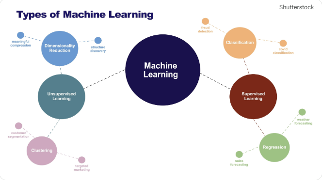

# Future Enhancements & Roadmap: HorizonScale

## Overview

This roadmap outlines the strategic evolution of the HorizonScale platform. The objective is to transition from the current high-performance forecasting baseline toward an advanced, self-optimizing capacity management ecosystem that leverages cutting-edge machine learning and hardware acceleration.

---

## 1. Algorithmic Evolution (Phase 1)

To build upon the current Prophet-based forecasting core, the next phase focuses on expanding the competition engine with deep learning and ensemble techniques.

* **Deep Learning Integration:** Incorporate Long Short-Term Memory (LSTM) networks to better capture long-range temporal dependencies and complex patterns in server utilization.
* **Gradient Boosting Models:** Integrate XGBoost and LightGBM into the model competition stage to handle non-linear relationships and high-dimensional feature sets.
* **Ensemble Forecasting:** Implement a weighted ensemble approach where the final forecast is a optimized combination of multiple top-performing models rather than a single winner.

## 2. Hardware & Infrastructure Acceleration (Phase 2)

Building on the "Turbo" multiprocessing foundation, this phase targets hardware-level optimizations to handle massive scaling.

* **End-to-End GPU Acceleration:** Transition data transformation and model training tasks to GPU-accelerated libraries (such as NVIDIA cuDF or RAPIDS) to further reduce processing time for estates exceeding 5,000 nodes.
* **Distributed Computing (Dask/Ray):** Explore migrating from local multiprocessing to distributed frameworks like Dask or Ray to allow HorizonScale to scale across a cluster of nodes.
* **Vectorized Data Processing:** Further optimize the data pipeline using vectorized operations to minimize the overhead of large-scale Parquet file manipulation.

## 3. Advanced Feature Engineering (Phase 3)

Enhancing the data pipeline to reflect more complex environment variables and improve predictive accuracy.

* **Exogenous Variable Injection:** Incorporate external "signals" into the forecast, such as application release calendars, marketing events, or holiday cycles, to improve accuracy during known load shifts.
* **Automated Anomaly Correction:** Develop a dedicated pre-processing module that automatically identifies and "repairs" historical data points caused by known hardware failures or maintenance windows.
* **Clustering Analysis:** Implement K-Means or similar clustering to group servers with similar utilization profiles, allowing for more targeted hyperparameter tuning.

## 4. Intelligent Automation & Alerting (Phase 4)

Closing the loop between the "High Trust" forecast and operational infrastructure actions.

* **Self-Healing Recommendations:** Integrate the risk dashboard with an advisory engine that suggests specific remediation steps (e.g., vertical scaling or resource migration) based on the 90-day high-trust window.
* **Real-time API Integration:** Move from batch-style monthly exports to a real-time API endpoint that provides "on-demand" capacity lookups for application managers.
* **Automated Escalation Logic:** Enhance the notification engine to trigger automated service requests based on the severity and proximity of a predicted capacity breach.

---

## Future State Vision

The goal of this roadmap is to transform HorizonScale into a proactive infrastructure partner, moving beyond simple observation into a predictive, automated, and highly scalable resource optimization platform.