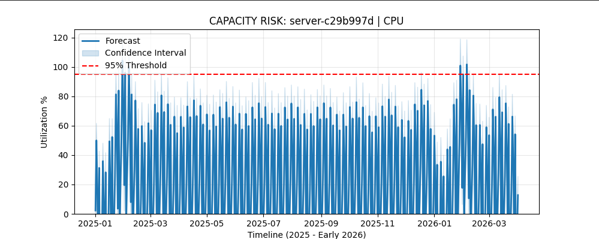
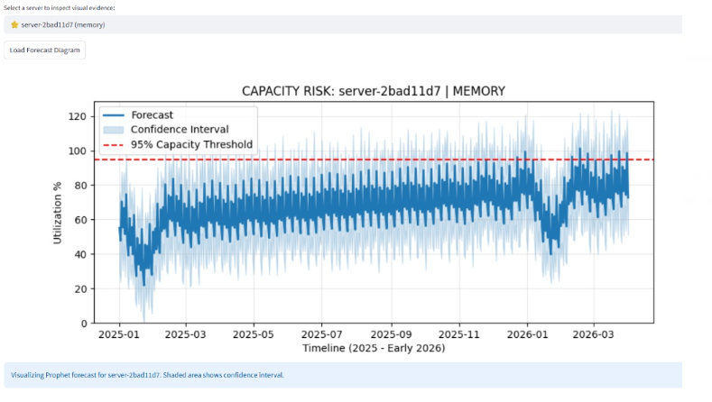

# Testing and Validation Strategy: HorizonScale

## Overview

This document outlines the multi-layered testing and validation framework used to ensure data integrity, model accuracy, and system reliability within the HorizonScale pipeline. The strategy encompasses data quality gates, statistical backtesting, and performance verification.

---

## 1. Data Integrity Validation

Before any forecasting occurs, the pipeline executes a series of data quality checks to ensure the foundation of the 3-year historical dataset is sound.

* **Schema Enforcement:** Verification that Parquet files conform to expected data types and structures, preventing downstream failures during model training.
* **Null and Outlier Detection:** Automated scanning of utilization metrics to identify and handle missing values or non-physical data points (e.g., utilization exceeding 100%).
* **Node Consistency:** Ensuring all 2,000+ server nodes are accounted for in the master Parquet export and that no data gaps exist in the 36-month history.

## 2. Statistical Backtesting

To validate the predictive power of the engine, HorizonScale utilizes a rigorous backtesting methodology.

* **Time-Series Cross-Validation:** The system partitions historical data into multiple "folds," training on older data and testing against more recent known values to calculate error metrics.
* **Accuracy Metrics:** Performance is measured using Mean Absolute Percentage Error (MAPE) and Root Mean Square Error (RMSE) to quantify forecast deviation.
* **Algorithm Benchmarking:** During the model competition phase, the performance of the primary engine is compared against challenger models to ensure the mathematically optimal forecaster is selected for each specific server profile.

## 3. Forecast Confidence Logic

Validation is not just about historical accuracy; it is also about quantifying future uncertainty.

* **The High-Trust Window:** The initial 90-day forecast undergoes a "Tightness Test" where the confidence intervals are analyzed. If the interval width exceeds a defined threshold, the trust status is downgraded.
* **Stability Analysis:** The system checks for "forecast jitter"—significant changes in the 6-month outlook between consecutive monthly runs—to identify models that may be overreacting to short-term noise.

## 4. System & Execution Testing

Beyond the data, the computational engine itself is validated for operational stability.

* **Parallelization Stress Test:** Validation of the multiprocessing pool to ensure that CPU-bound tasks are distributed efficiently without memory leaks or race conditions.
* **Configuration Validation:** Pre-run checks on global parameters to confirm that environment-specific variables are correctly loaded before the pipeline initializes.
* **End-to-End Integration:** Automated verification that outputs from the synthetic data layer successfully flow through the data pipeline and into the final risk reporting and dashboard modules.

---

## 5. Success Criteria

A validation run is considered successful only when:

1. Data completion rate for the historical foundation is 100%.
2. Forecast error metrics (MAPE) fall within the pre-defined organizational tolerance.
3. The multiprocessing engine completes execution within the established "Turbo" performance benchmarks.
4. Risk reports are successfully generated for all 2,000+ nodes without exception.